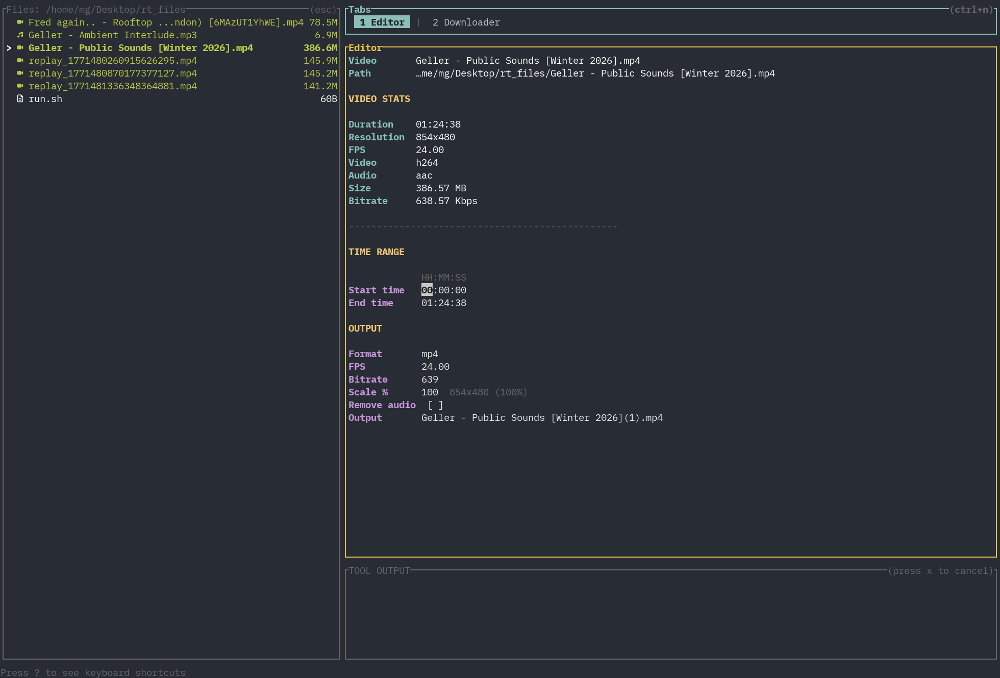
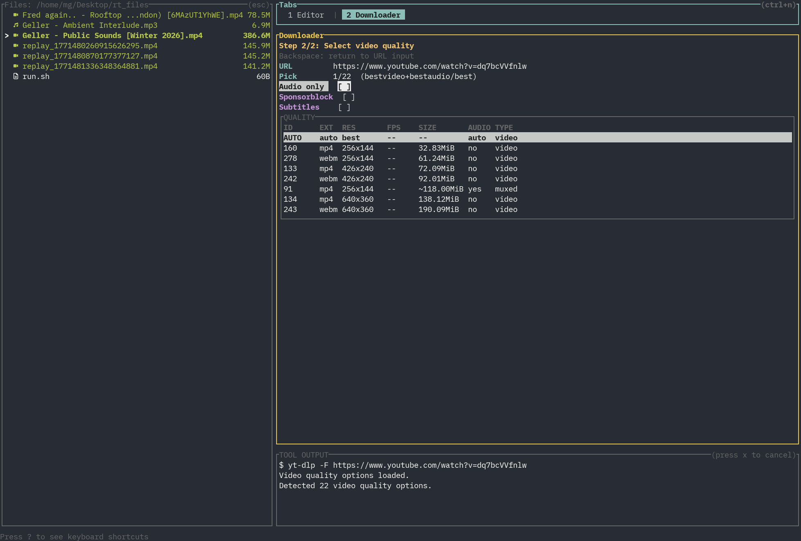

# rt

A terminal UI (TUI) built with `ratatui` for downloading and editing media
(yt-dlp).

## What it does

- **File browser** on the left (navigate folders, open/delete files).
- **Editor tab** (ffmpeg wrapper) to trim clips and export media.
- **Downloader tab** (yt-dlp wrapper) to fetch media with quality/options selection.
- **Tool output panel** live command output.

## Requirements

- Rust toolchain
- `ffmpeg` + `ffprobe` (Editor)
- `yt-dlp` (Downloader)

## Run

```bash
cargo run
```

Optional start directory:

```bash
cargo run -- /path/to/start/dir
```

## Screenshots

### Editor



### Downloader



## Disclaimer

Built almost entirely with Codex 5.3. This was an experiment to see how far I
coulud push LLM tooling.
